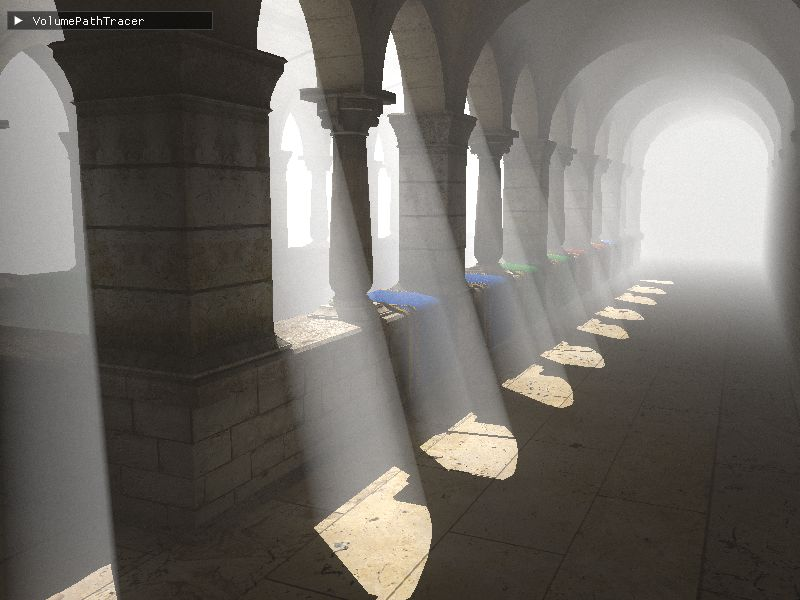
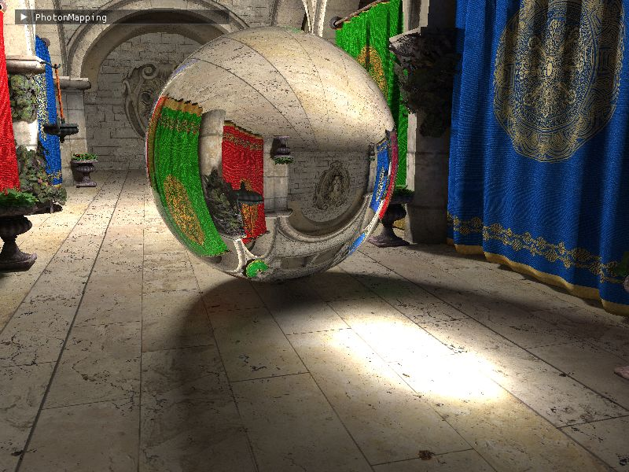
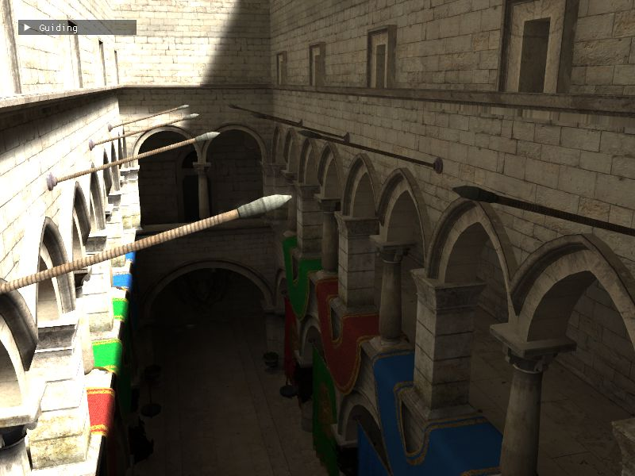

# ReCoRe
Personal framework for **Re**ndering and **Co**mpute **Re**search, with a main focus on real-time path tracing. The structure is inspired by NVIDIA's Falcor framework, but with direct access to the underlying Vulkan API.

## Screenshots
| Volumetric Path Tracing | Photon Mapping | Guiding + Denoising + TAA |
| --- | --- | --- |
|  |  | 

## Features
- Real-time Path Tracing using Vulkan Ray Tracing for global illumination
- Rasterized GBuffer for fast primary visibility
- GLTF scene loading (standard PBR model + refractive materials)
- Frostbite BRDF and GGX importance sampling
- World-space hash grid
- Guiding based on parametric von-Mises-Fisher Mixture Models
- Photon Mapping for caustics of analytic light sources
- Normal mapping (+ [Normal Mapping based Microfacet Model](https://cg.ivd.kit.edu/publications/2017/normalmaps/normalmap.pdf) for path tracing)
- Denoising using temporal reprojection + A-Trous Wavelet filter (similar to SVGF)
- Temporal Anti-Aliasing (Halton subpixel jittering)
- Runtime shader compilation + hot reload
- Dynamic scenes + acceleration structure updates
- Live Pixel Debugging using [GL_EXT_debug_printf](https://github.com/KhronosGroup/GLSL/blob/main/extensions/ext/GLSL_EXT_debug_printf.txt)
- Reflective Shadow Maps + [Light Propagation Volume](https://advances.realtimerendering.com/s2009/Light_Propagation_Volumes.pdf) as approximative alternative to Path Tracing
- Headless rendering for evaluation purposes
- Simple GUI using ImGUI

## Samples
A few sample projects using the features of the framework can be found in [samples](src/samples/).
- Simple Path Tracer: Path Tracer using a simple diffuse Lambert BRDF and a denoising + TAA post processing pass
- Photon Mapping: a glass sphere is placed in the scene to create caustics from analytic light sources (sphere or directional)
- Guiding: Train a VMM in a world-space hadh grid using [smart indexing](https://gpuopen.com/download/publications/SA2021_WorldSpace_ReSTIR.pdf) and combine with denoising + TAA for better stability
- Volume: Volumetric Path Tracer with Multiple-Scattering in a homogeneous medium (fog)

## Dependencies
Almost all dependencies are built from source as git submodules (see [external](external)).
On Linux the [dependencies for GLFW](https://www.glfw.org/docs/3.3/compile.html#compile_manual) are required, i.e. the dev packages for X11 or Wayland.
A ray-tracing capable GPU is required for the provided samples (project was only tested NVIDIA).
Assets are not part of the repository and need to be downloaded separately.
Use CMake to build one of the sample applications.
